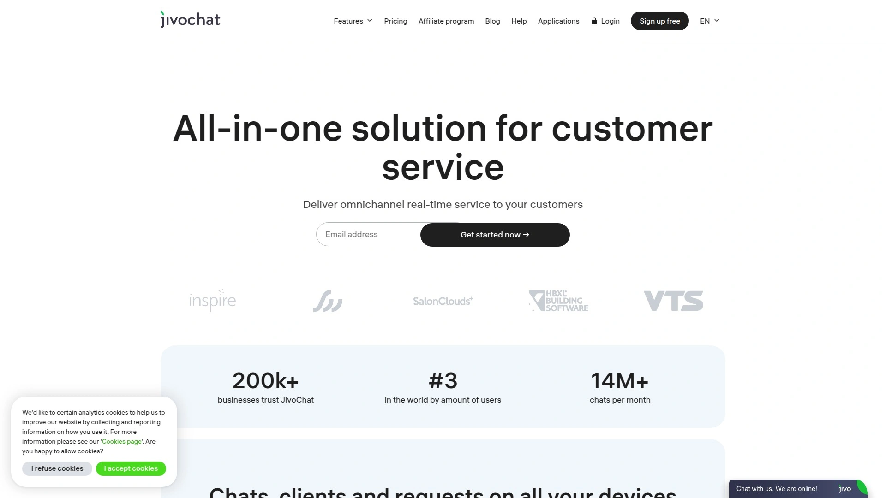
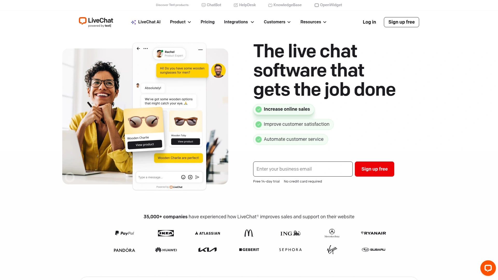
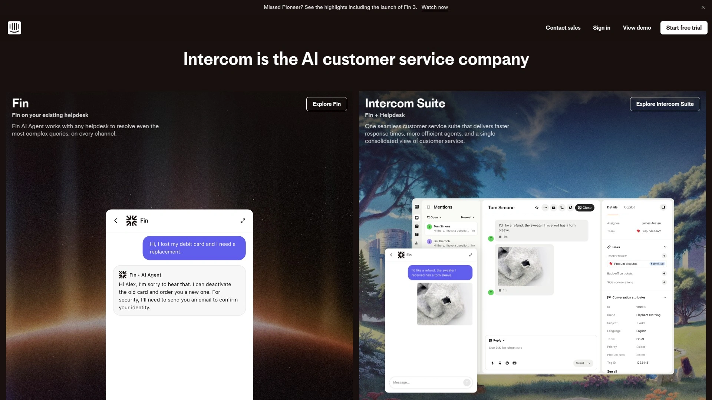
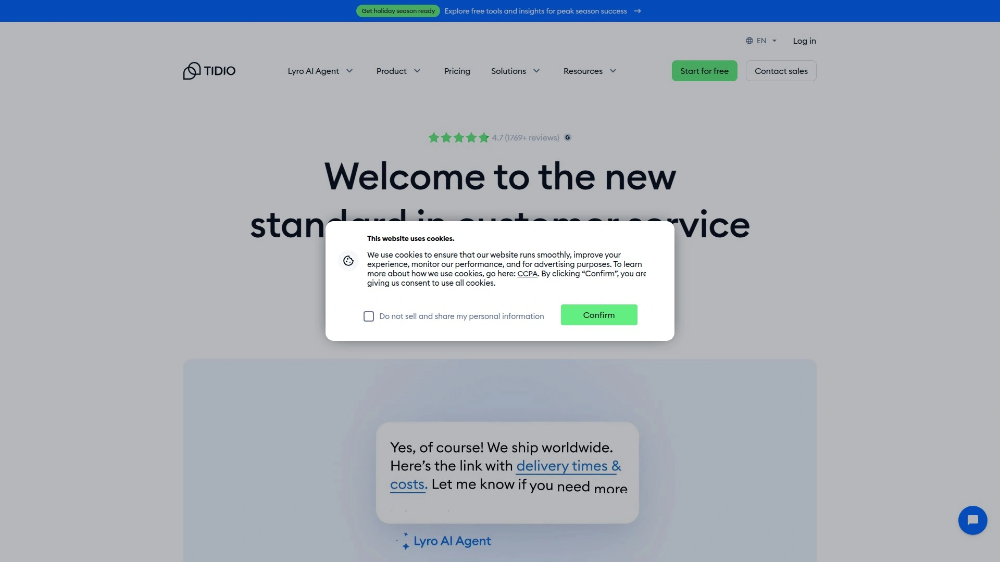
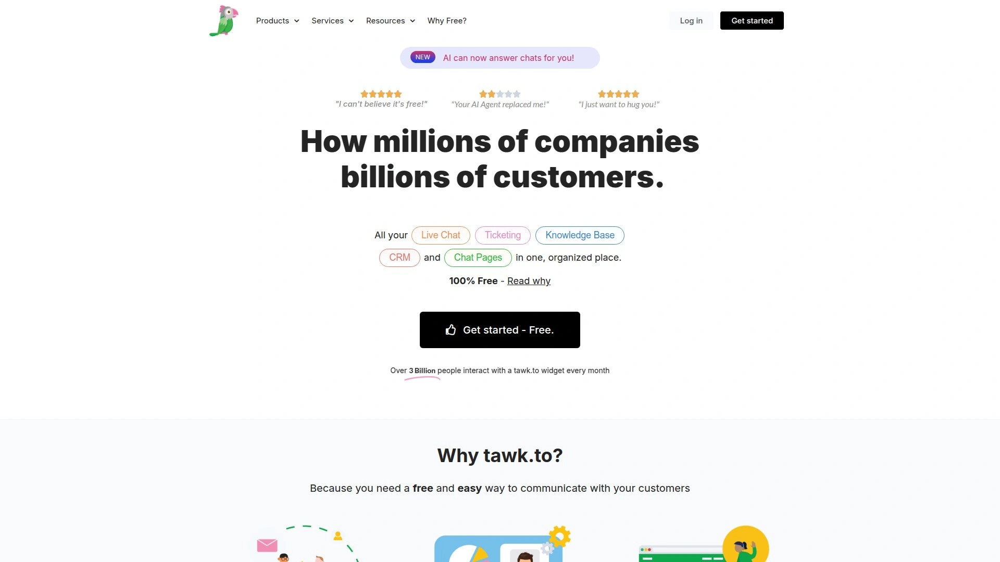
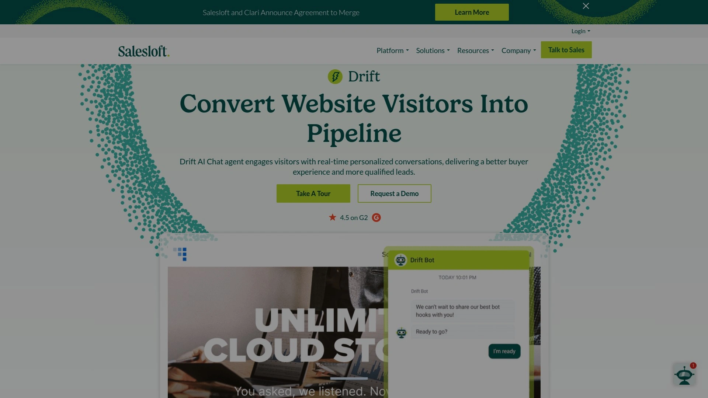
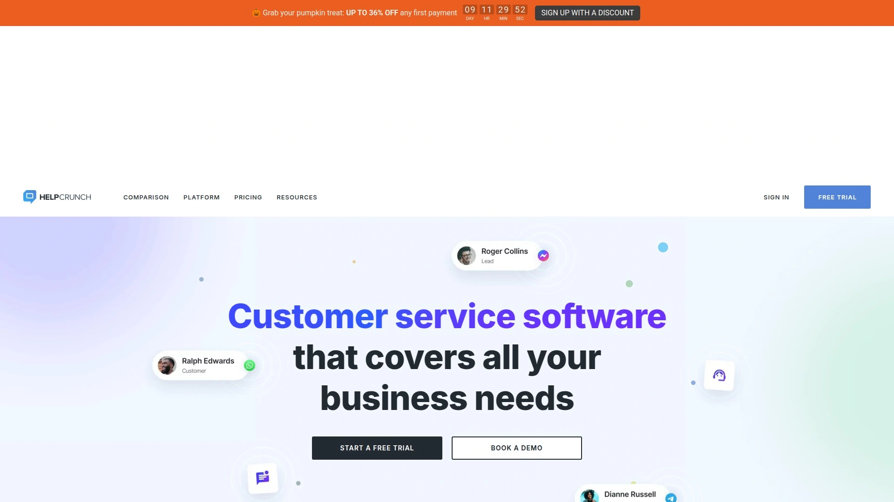
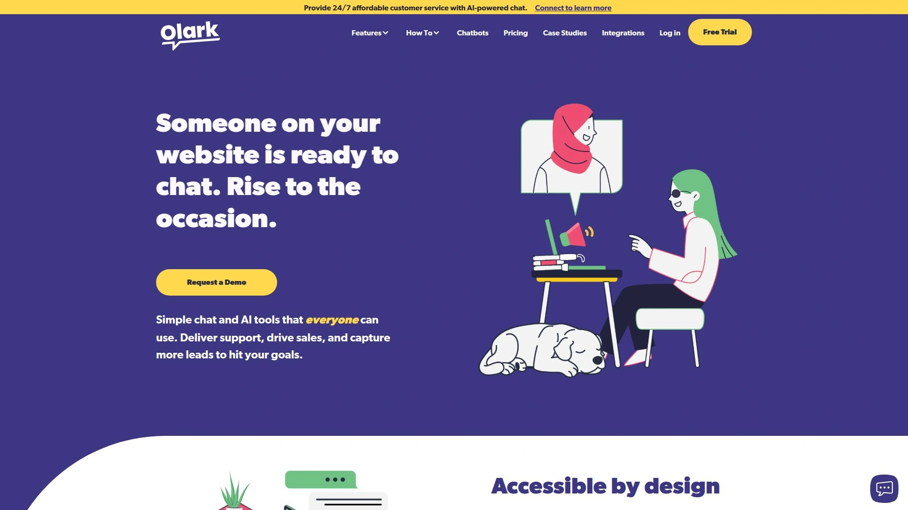

# 2025's Top 9 Best Omnichannel Customer Communication Platforms

Customer expectations hit a new level—people want answers immediately, conversations that flow naturally across channels, and support teams who actually remember what was discussed five minutes ago on a different platform. Traditional live chat widgets that exist in isolation don't cut it anymore. Modern businesses need omnichannel communication platforms that unify conversations from website chat, email, social media, SMS, and phone calls into one coherent stream. These platforms let support teams respond faster, reduce the "can you repeat that" friction, and turn casual browsers into paying customers through smarter engagement.

***

## **[JivoChat](https://jivochat.com)**

All-in-one business messenger unifying five channels in a single interface.

JivoChat consolidates live chat, phone, email, Facebook, and WhatsApp into one omnichannel application built specifically for e-commerce companies and service businesses. More than 270,000 online businesses worldwide use the platform to handle customer inquiries without juggling multiple tools. The system keeps complete chat history and message threads accessible in one unified inbox, eliminating the chaos of switching between communication channels.

The live chat widget loads fast on websites and functions smoothly across all mobile browsers—tested and confirmed by actual users navigating sites on phones and tablets. Proactive chat invitations trigger based on visitor behavior, letting you engage potential customers at strategic moments before they bounce. The native mobile menu keeps conversations accessible whether customers browse on desktop or mobile devices.

**Channel Integration & Business Phone**

JivoChat provides phone numbers in over 50 countries or lets you activate existing numbers for making outgoing calls with professional features like call recording, transfers, and smart routing. The Instant Callbacks feature encourages potential customers to initiate calls, shortening the path from interest to closed deal. Email redirection from your company address flows into the JivoChat inbox where your team replies faster without messages slipping through cracks.

Real-time monitoring shows which webpage visitors currently view, which domain referred them, and whether they're engaged in active chat sessions. You can see visitor engagement levels before initiating conversations, personalizing your approach based on browsing behavior. Agents access canned responses through the Quick Phrases Helper—just type / followed by the response name to insert pre-written answers instantly.

The free plan supports unlimited chats with basic features, while the Professional plan at $19/agent/month adds chatbot building, call recording, and advanced visitor tracking. Enterprise VIP pricing starts at $38/agent/month for teams with 10+ agents, unlocking mobile app SDK chat, routing automation, video calls, and dedicated support. The 14-day free trial requires no credit card.

---

## **[LiveChat](https://livechat.com)**

Established leader with 200+ integrations serving real-time customer conversations.

LiveChat built its reputation on speed and customization flexibility since launching in 2002. The platform now serves thousands of businesses providing instant messaging capabilities that reduce response times and boost customer satisfaction. Real-time chat functionality lets support agents connect with website visitors the moment questions arise, dramatically improving conversion rates compared to delayed email exchanges.

Chat window customization extends beyond basic color changes—businesses adjust themes, positions, greeting messages, and engagement triggers to match brand identity perfectly. Message sneak-peek shows agents what visitors type before hitting send, allowing preparation of responses while customers still compose questions. This seemingly small feature cuts response times significantly during high-volume periods.

**Smart Routing & Queue Management**

Automated chat distribution assigns incoming conversations to available agents based on predefined rules considering factors like department, agent expertise, language capabilities, and current workload. During traffic spikes, queue management places visitors in organized waiting lines with transparent position updates and estimated wait times, preventing frustrated abandonment.

The comprehensive analytics dashboard tracks agent performance metrics, conversation quality, chat volume patterns, and customer satisfaction scores. Integration marketplace offers over 200 pre-built connectors to CRM systems, e-commerce platforms, marketing automation tools, and help desk software. Popular connections include Shopify, HubSpot, Salesforce, Zapier, and Mailchimp.

LiveChat's mobile applications for iOS and Android ensure agents stay connected even away from desks. Proactive chat invitations based on visitor behavior let businesses engage browsers showing purchase intent before they navigate away. Pricing starts at $20/agent/month with annual billing, positioning the platform competitively in the mid-market segment.

***

## **[Zendesk](https://zendesk.com)**

Enterprise omnichannel powerhouse with unified agent workspace and AI automation.

Zendesk dominates the enterprise customer service space with its comprehensive suite handling email, web forms, live chat, messaging apps, voice calls, SMS, and help center self-service. The Agent Workspace consolidates conversations from every channel into single ticket timelines, giving support teams complete context without browser tab gymnastics. This unified view means customers never repeat information when switching from chat to phone to email.

Channel integrations span WhatsApp, Facebook Messenger, Instagram, Twitter, WeChat, and LINE alongside traditional support channels. Voice and SMS conversations automatically convert to trackable tickets with full recording and transcription capabilities. The knowledge base system powers self-service deflection, letting customers find answers independently before creating support requests.

**Omnichannel Routing Intelligence**

Zendesk's routing engine considers agent status, current capacity limits, specialized skills, and customer priority when distributing new tickets. Capacity controls prevent agent overwhelm by capping simultaneous chats or tickets per person. Skills-based routing on higher-tier plans matches technical issues to agents with relevant expertise, improving first-contact resolution rates.

AI agents handle common queries automatically, resolving routine issues without human intervention. The platform maintains conversation continuity when customers switch channels mid-interaction—a chat started on the website seamlessly continues via WhatsApp without context loss. Reporting dashboards track performance across channels, identifying bottlenecks and optimization opportunities.

Enterprise-grade security features include role-based access controls, single sign-on, compliance certifications for healthcare and finance, and audit trails. Zendesk Suite Team pricing starts at $19/agent/month, while higher tiers unlock advanced AI, workforce management, and custom objects. The platform scales from small teams to global support operations handling millions of monthly interactions.

***

## **[Intercom](https://intercom.com)**

AI-first customer messaging platform with Fin AI Agent resolving queries autonomously.

Intercom pioneered modern customer messaging by combining live chat, email, in-app notifications, and automated workflows into one cohesive system. Over 25,000 businesses use the platform to provide conversational support that feels personal rather than transactional. The unified inbox aggregates conversations from all channels, helping support teams collaborate and respond faster without hunting for message threads.

Fin AI Agent represents Intercom's flagship AI feature—it autonomously handles customer questions by learning from knowledge base content, previous support interactions, and product documentation. The AI resolves common issues instantly while escalating complex situations to human agents with full context. This automation significantly reduces support workload while maintaining response quality.

**Proactive Engagement & Targeting**

Customer segmentation based on behavior, product usage, location, and custom attributes enables highly targeted messaging. Businesses send personalized emails, in-app messages, and push notifications to specific user groups at optimal moments. Automated workflows trigger follow-up sequences, onboarding campaigns, and re-engagement initiatives without manual intervention.

The self-service help center features smart search that surfaces relevant articles as customers type questions. Interactive product tours and checklists guide new users through key features, reducing support ticket volume during onboarding phases. In-app messaging lets businesses communicate with users directly inside web or mobile applications, providing contextual help exactly where needed.

Conversation history tracking shows every past interaction with individual customers alongside their product activity, purchase data, and support ticket status. This comprehensive profile helps agents understand context instantly. Intercom integrates deeply with Salesforce, Marketo, Stripe, Segment, and other business tools, synchronizing customer data across platforms. Pricing starts at $39/seat/month for essential features, with higher tiers adding advanced AI, analytics, and customization options.

***

## **[Tidio](https://tidio.com)**

E-commerce focused platform with Lyro AI chatbot and visual automation builder.

Tidio designed its platform specifically for online stores running on Shopify, WooCommerce, Wix, and BigCommerce. The live chat widget integrates seamlessly with e-commerce platforms, giving support agents visibility into customer cart contents, past orders, and browsing history during conversations. This contextual awareness helps representatives provide relevant product recommendations and resolve purchase obstacles faster.

Lyro AI chatbot handles product questions, order status inquiries, and common support issues automatically using conversational AI trained on your store's data. Unlike rigid rule-based bots, Lyro understands natural language variations and learns from interactions to improve response accuracy. When questions exceed AI capabilities, smooth handoffs transfer conversations to human agents without customers noticing transitions.

**Automation Flows & Cart Recovery**

Visual flow builder creates automated conversation sequences without coding—drag-and-drop interfaces let non-technical users design complex chatbot workflows. Popular use cases include abandoned cart recovery messages, discount code delivery based on browsing behavior, post-purchase follow-ups, and product recommendation quizzes.

Real-time visitor monitoring shows who's browsing your store right now, which products they're viewing, and how long they've spent on specific pages. Support teams proactively engage high-value visitors showing purchase intent before they leave. Canned responses speed up repetitive answers, while message templates maintain brand voice consistency across team members.

Multichannel support brings Instagram, Facebook Messenger, and email into the same dashboard alongside website chat. Customer service tickets, chat transcripts, and automation analytics provide performance insights. The free plan supports up to 50 conversations monthly with basic features. Paid plans start at $24.17/month with annual billing, unlocking unlimited conversations, Lyro AI access, and advanced automation capabilities.

---

## **[Tawk.to](https://tawk.to)**

Completely free live chat with unlimited agents and zero subscription fees.

Tawk.to disrupted the live chat market by offering genuinely free software with no artificial limits on agent count, chat volume, or websites. Over 5 million businesses worldwide use the platform to provide real-time support without monthly subscription costs. The comprehensive feature set includes canned responses, offline forms, visitor tracking, file sharing, screen sharing, and complete chat history.

The free model works because Tawk.to monetizes through optional paid services rather than subscription fees—businesses can hire live chat agents starting at $1/hour or virtual assistants from $7.50/hour if they need extra support capacity. Removing the "Powered by tawk.to" branding costs $29/month for those wanting white-label appearance.

**Trigger Messaging & Knowledge Base**

Automated triggers initiate proactive conversations based on visitor location, page views, time spent on site, and previous visit history. Welcome messages greet returning customers by name, while targeted offers appear when browsers view specific product categories. The built-in ticketing system converts unanswered chats into support tickets for organized follow-up.

Knowledge base functionality lets businesses create self-service FAQ pages where customers find answers independently. Article search helps visitors solve common problems without initiating chats, reducing support workload. Tawk.to's mobile applications for iOS, Android, Windows, and Mac ensure teams stay connected regardless of device or location.

Integration options include WordPress, Joomla, Wix, Squarespace, Shopify, and Zapier connections. The platform supports 45+ languages, making it accessible for global businesses. While AI features remain basic compared to paid competitors, the comprehensive free offering provides exceptional value for startups, small businesses, and anyone testing live chat effectiveness before committing to premium solutions.

***

## **[Drift](https://drift.com)**

Conversational marketing platform turning website visitors into qualified sales meetings.

Drift approaches live chat from a sales and marketing angle rather than pure support focus. The platform specializes in capturing high-intent website visitors and converting them into qualified sales opportunities through intelligent conversations. AI-powered chatbots engage visitors, ask qualifying questions, and route promising leads directly to appropriate sales representatives.

The meeting scheduler integrates with team calendars, allowing chatbots to book sales calls automatically when prospects show purchase intent. This eliminates back-and-forth email scheduling, shortening time from initial interest to actual conversations. Drift's personalization engine tailors chat experiences based on visitor data, industry, company size, and previous interactions.

**Lead Scoring & Sales Acceleration**

Conversation data feeds into lead scoring algorithms that prioritize outreach based on engagement quality and fit indicators. Sales teams focus energy on prospects showing genuine buying signals rather than wasting time on tire-kickers. Real-time notifications alert representatives when target accounts visit the website, enabling immediate engagement during active research phases.

Video messaging features let sales reps send personalized video introductions or product demonstrations through chat, adding human touch at scale. Email integration brings conversations from multiple channels into unified threads. ABM (account-based marketing) playbooks trigger specific chat experiences for target company employees visiting your site.

Drift integrates deeply with Salesforce, HubSpot, Marketo, and major marketing automation platforms, syncing conversation data into existing workflows. The platform works best for B2B companies with active sales teams who want chat serving as a demand generation tool. Pricing reflects this premium positioning—while exact costs vary based on company size and features, Drift typically costs more than support-focused alternatives but delivers ROI through accelerated pipeline velocity.

***

## **[HelpCrunch](https://helpcrunch.com)**

Affordable all-in-one platform combining chat, email marketing, and knowledge base.

HelpCrunch bundles live chat, chatbots, email marketing campaigns, popups, and knowledge base functionality into one integrated platform. This comprehensive approach eliminates need for separate tools handling different customer communication aspects. Small to medium businesses particularly appreciate the unified system reducing tool sprawl and subscription costs.

The live chat widget offers standard features like canned responses, file sharing, chat transcripts, and visitor information. Chatbot builder uses visual flow design for creating automated conversation sequences without coding knowledge. Pre-built templates accelerate setup for common scenarios like lead capture, FAQ responses, and appointment booking.

**Email Campaigns & Popup Widgets**

Built-in email marketing tools let businesses send newsletters, promotional campaigns, and automated sequences directly from HelpCrunch. Segmentation based on customer attributes and behavior ensures relevant messaging. Email conversations integrate with chat history, providing complete communication context regardless of channel customers choose.

Popup widgets capture email addresses, promote special offers, or survey visitors without interrupting browsing experience. Smart targeting shows popups based on visit duration, exit intent, page views, or custom triggers. Knowledge base articles reduce support volume by helping customers self-serve answers to common questions.

Multi-language support makes HelpCrunch viable for international businesses serving global audiences. Team collaboration features include private notes, chat transfers between agents, and performance analytics. Pricing remains competitive compared to enterprise platforms—plans start around $12/agent/month with annual commitment, scaling based on features and agent count. The platform suits businesses wanting comprehensive functionality without enterprise-level complexity or costs.

***

## **[Olark](https://olark.com)**

Simple, human-focused live chat prioritizing conversation quality over complexity.

Olark maintains deliberately straightforward approach to live chat, avoiding feature bloat in favor of reliable core functionality. The platform appeals to small teams and sales organizations wanting uncomplicated tools that work consistently. Setup takes minutes rather than weeks—embed a code snippet on your website and start chatting immediately.

Rules-based automation handles basic proactive messaging like greeting returning visitors or offering help after time on page. These simple triggers prove effective without requiring complex configuration or AI training. The focused feature set means less time wrestling with software and more time actually helping customers.

**Team Collaboration & Integrations**

Chat transcripts automatically store conversation history for future reference and quality monitoring. Searchable archives help teams identify common pain points and improve support processes. Olark integrates cleanly with HubSpot, Salesforce, Slack, and Google Analytics, syncing chat data into existing business systems without complicated setup.

Team management features include chat routing, availability status controls, and agent performance metrics. Customizable chat box matches brand aesthetics through color, text, and position adjustments. Offline forms collect visitor information when no agents are available, converting into leads for follow-up.

The platform works particularly well for B2B sales teams using chat primarily for qualifying inbound leads and scheduling discovery calls. Reporting provides visibility into chat volume, response times, and customer satisfaction without overwhelming users with excessive metrics. Pricing starts at $29/month for single users, with team plans scaling based on agent count. Olark represents the "just works" option for businesses prioritizing simplicity and reliability over cutting-edge AI features.

***

## How do omnichannel platforms differ from regular live chat software?

Omnichannel platforms unify conversations across multiple channels—website chat, email, SMS, social media, phone—into single continuous threads. Regular live chat software only handles website widget conversations in isolation. When customers switch from chat to email with omnichannel systems, agents see complete interaction history automatically. Regular chat treats each channel as separate, forcing customers to repeat information and frustrating both parties. The unified approach dramatically improves customer experience and support efficiency.

## Should small businesses invest in paid live chat or start with free options?

Start with free platforms like Tawk.to or JivoChat's free tier to validate whether live chat benefits your specific business. If you see increased conversions, faster support resolution, or customer satisfaction improvements after 2-3 months, upgrade to paid platforms offering automation, better analytics, and advanced routing. Free tools provide genuine value—many businesses operate successfully on free plans indefinitely. Paid upgrades make sense when volume increases, team size grows, or you need specific features like AI chatbots, CRM integrations, or video calls.

## What's the realistic ROI timeline for implementing live chat software?

Most businesses notice immediate improvements in customer engagement within the first week as website visitors start initiating conversations. Meaningful ROI—measured through increased conversions, reduced support costs, or improved customer satisfaction scores—typically becomes measurable within 30-60 days after launch. The timeline depends on chat widget visibility, proactive engagement strategies, and agent response quality. Track metrics like conversion rate changes on pages with chat, average response times, and customer feedback to quantify impact. Businesses seeing no improvement after 90 days usually need better chat placement, more proactive messaging, or faster agent response rather than different software.

---

## Making the Right Choice

Live chat evolved from nice-to-have website widgets into essential omnichannel communication hubs that can make or break customer experience. The platforms listed here all solve the core problem of connecting businesses with customers in real-time, but they approach the challenge differently—some prioritize simplicity, others emphasize AI automation, and several focus on specific industries like e-commerce or B2B sales. [JivoChat](https://jivochat.com) particularly suits businesses wanting true omnichannel unification without overwhelming complexity—the platform consolidates website chat, phone, email, Facebook, and WhatsApp into one interface with professional business phone features and straightforward pricing that scales from free plans to enterprise deployments. Whether you're handling support tickets, qualifying sales leads, or just want to stop missing website visitors asking questions while nobody's watching, the right live chat platform stops conversations from slipping through the cracks.
